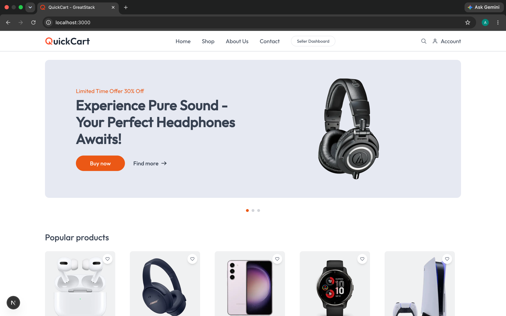

# E-Commerce Website (Next.js)

A modern and responsive eCommerce web application built using Next.js. This project provides a smooth and fast shopping experience with product browsing, cart management, and secure authentication.

---

## 🚀 Features

- Responsive design for all devices  
- Product listing and product details page  
- Shopping cart functionality  
- User authentication system  
- Secure checkout flow  
- Fast performance with Next.js SSR/SSG  
- SEO optimized pages  

---

## 🛠️ Tech Stack

- Next.js  
- React.js  
- JavaScript / TypeScript  
- Tailwind CSS / CSS Modules  
- Node.js (Backend API if used)  
- MongoDB / Any database  

---

## 📸 Screenshot

<p align="center">
  
</p>

---

## 📁 Project Structure

```text
├── app/ or pages/
├── components/
├── public/
├── screenshots/
│   └── home-page.png
├── styles/
├── lib/
├── package.json
└── README.md
# Ecommerce-Website
